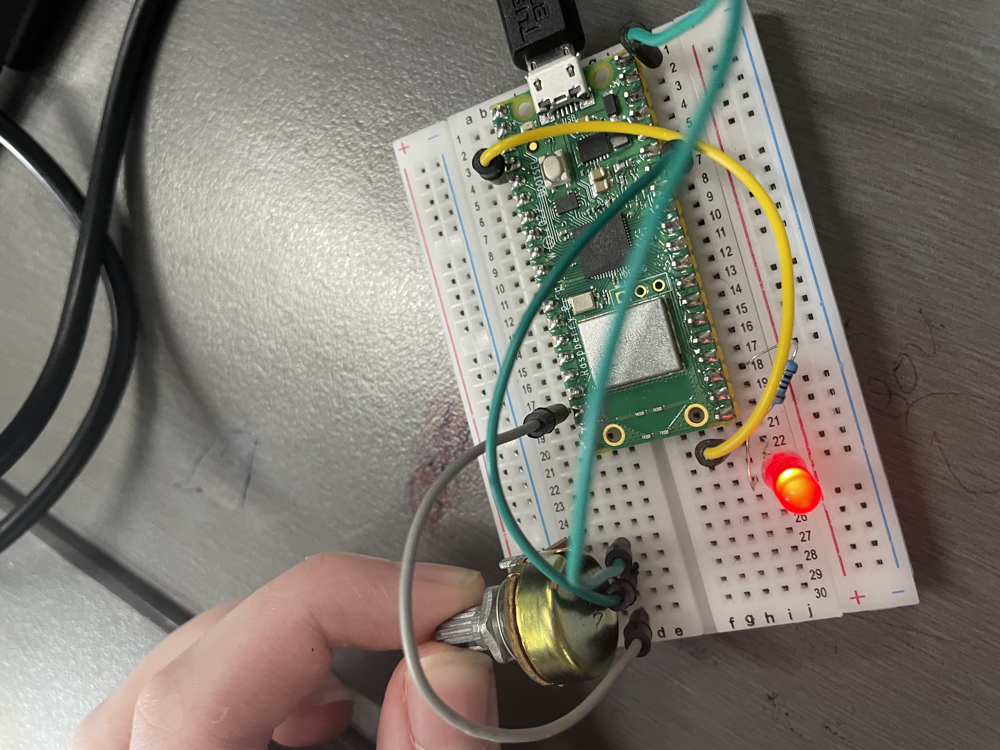
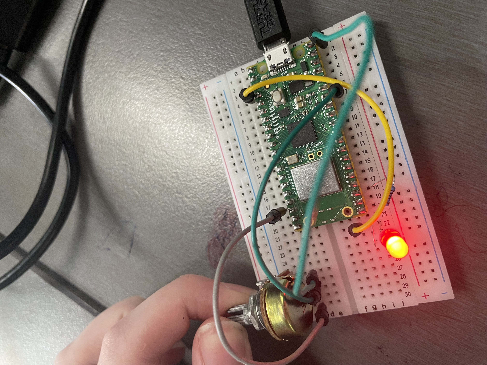

# Introduction
This is MicroPython code used to brighten or dim an led using a rotary potentiometer on a Pico W. I made this as a response to the Term 4 IT assesment task.

The led's brightness changes when the potentiometer's shaft turns. It is dimmist when it is or is close to 0 degrees, or near the GND pin, and brightest when it is close to ANGLE_MAX, or near the VCC pin.

# Getting Started
Here is how to get this code up and running on your system:
1. Download the lastest version of Visual Studio Code
2. Make sure you have these components:
   - A Pico W Pi
   - A rotary potentiometer
   - A breadboard
   - An led
   - 4 jumper cables
   - A 100 ohm resistor
3. Install MircoPython in your Pico
4. Make sure you have the latest version of Python installed on your computer
5. Go to extentions in VS Code and install 'MicroPico'
6. Create a directory on your local computer, and open the empty directory in VS Code
7. Run 'MicroPico > Configure Project' command via Ctrl+Shift+P (or the equivalent on your platform) VS Code command palette.
8. Download my Python file
9. Use the components to wire the Pico like this:
    1. Place the Pico W, potentiomemter and the led on the breadboard.
    2. Connect the anode (positive leg) of the led to a GPIO pin with a jumper cable (I chose GP2).
    3. Connect the cathode (negative leg) to a GND pin of the Pico through the resistor.
    4. Connect the VCC pin of the potentiometer to a power output pin on the Pico W with a jumper cable.
    5. Connect the GND pin to a GND pin on the Pico with a jumper cable.
    6. Connect the OUT pin to a GPIO pin with ADC capabilities with a jumper cable (I chose GP28).
   
   It should look like this:
